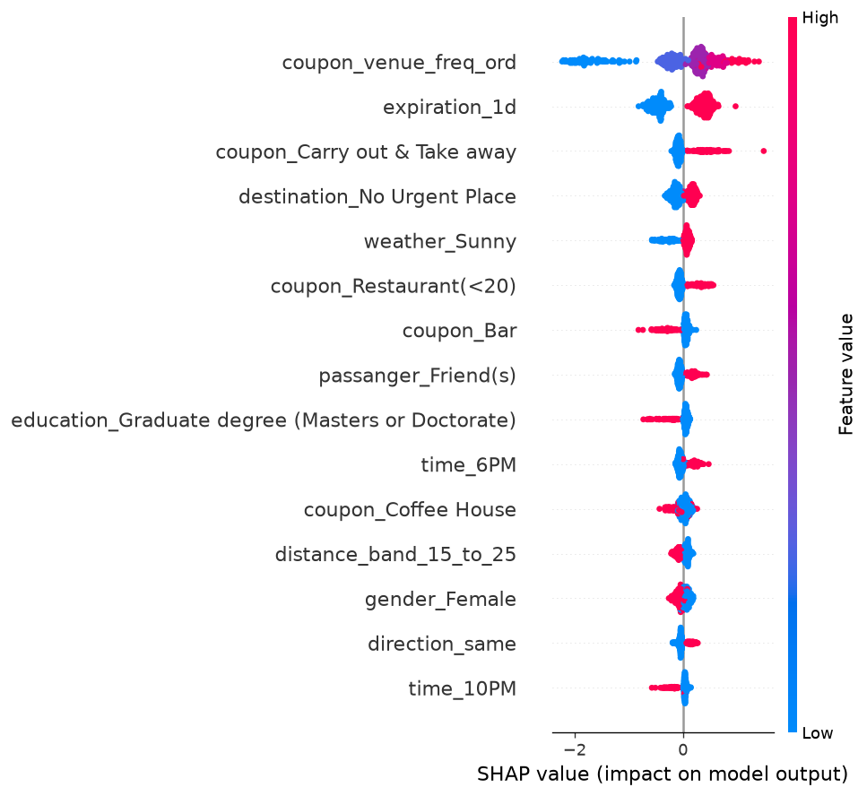
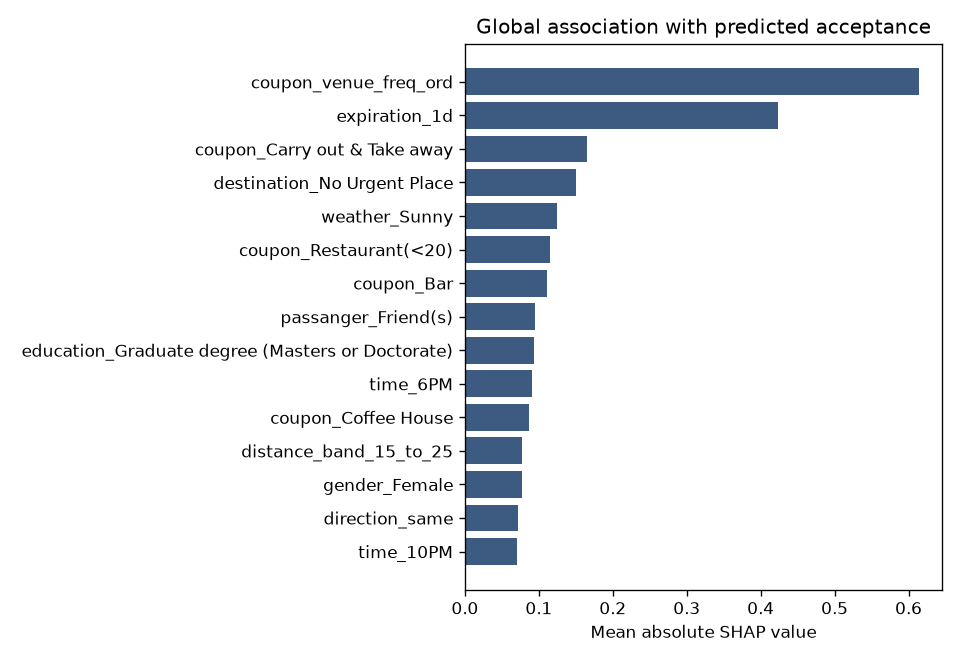
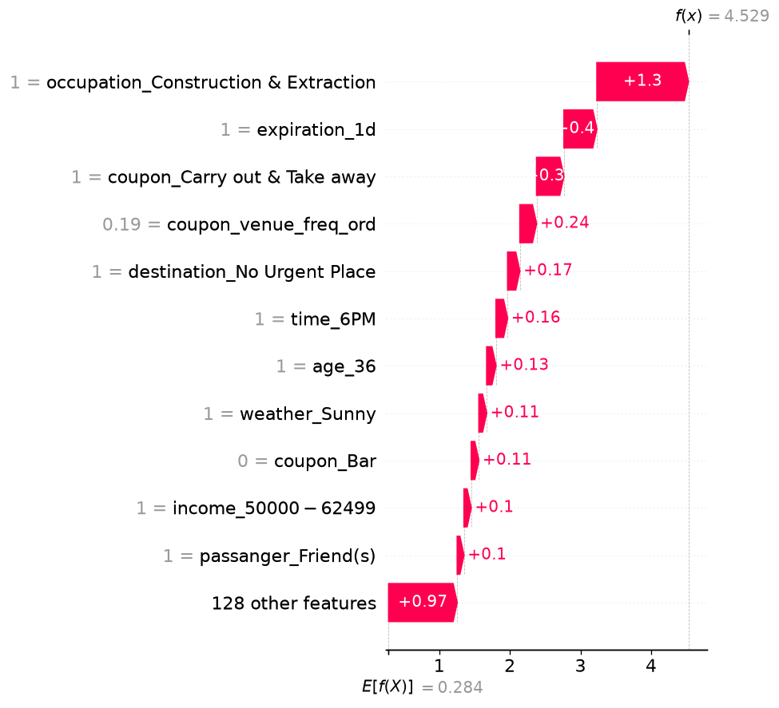
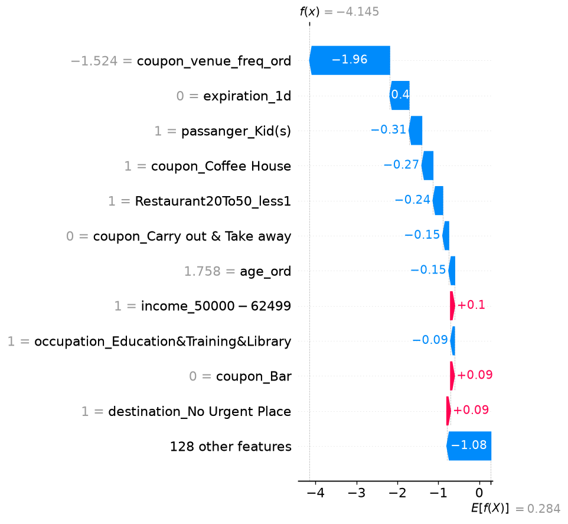

# SHAP explanations

Selected model: tuned XGBoost, fit on the training file. SHAP values below use a sample of training rows passed through the same preprocessing pipeline.

These are associations with the model's predicted acceptance probability. They are not causes of coupon acceptance.
Local values are the preprocessed inputs the model sees, including one-hot flags and scaled numbers.

## Global features

Mean absolute SHAP on the sample. Larger values mean the feature moved the prediction more, in either direction.

| Feature | Mean absolute SHAP |
| --- | ---: |
| coupon_venue_freq_ord | 0.6145 |
| expiration_1d | 0.4228 |
| coupon_Carry out & Take away | 0.1656 |
| destination_No Urgent Place | 0.1502 |
| weather_Sunny | 0.1242 |
| coupon_Restaurant(<20) | 0.1158 |
| coupon_Bar | 0.1116 |
| passanger_Friend(s) | 0.0952 |
| education_Graduate degree (Masters or Doctorate) | 0.0940 |
| time_6PM | 0.0906 |

## Higher predicted probability

Age 36, Male, destination No Urgent Place, passanger Friend(s), coupon Carry out & Take away, time 6PM, weather Sunny, expiration 1d. Predicted acceptance probability 0.989. Recorded training label 1.

- `occupation_Construction & Extraction` (value 1.000) was associated with a higher predicted acceptance probability (SHAP +1.297).
- `expiration_1d` (value 1.000) was associated with a higher predicted acceptance probability (SHAP +0.466).
- `coupon_Carry out & Take away` (value 1.000) was associated with a higher predicted acceptance probability (SHAP +0.387).
- `coupon_venue_freq_ord` (value 0.190) was associated with a higher predicted acceptance probability (SHAP +0.236).
- `destination_No Urgent Place` (value 1.000) was associated with a higher predicted acceptance probability (SHAP +0.173).

## Lower predicted probability

Age 50plus, Female, destination No Urgent Place, passanger Kid(s), coupon Coffee House, time 6PM, weather Sunny, expiration 2h. Predicted acceptance probability 0.016. Recorded training label 0.

- `coupon_venue_freq_ord` (value -1.524) was associated with a lower predicted acceptance probability (SHAP -1.956).
- `expiration_1d` (value 0.000) was associated with a lower predicted acceptance probability (SHAP -0.473).
- `passanger_Kid(s)` (value 1.000) was associated with a lower predicted acceptance probability (SHAP -0.313).
- `coupon_Coffee House` (value 1.000) was associated with a lower predicted acceptance probability (SHAP -0.273).
- `Restaurant20To50_less1` (value 1.000) was associated with a lower predicted acceptance probability (SHAP -0.238).

